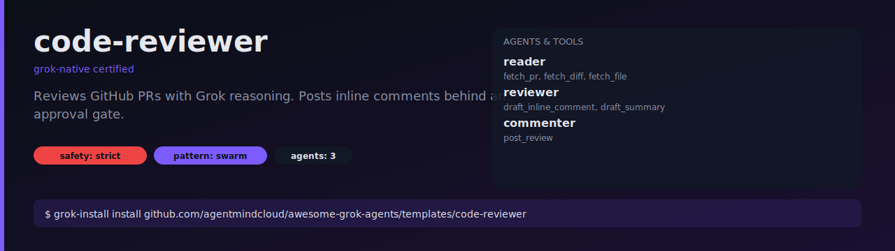
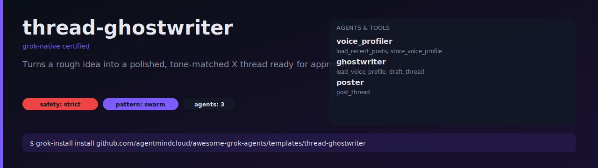
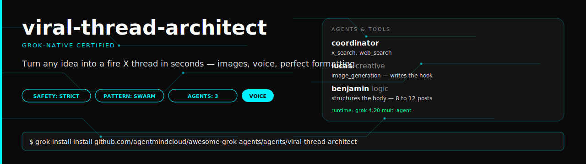
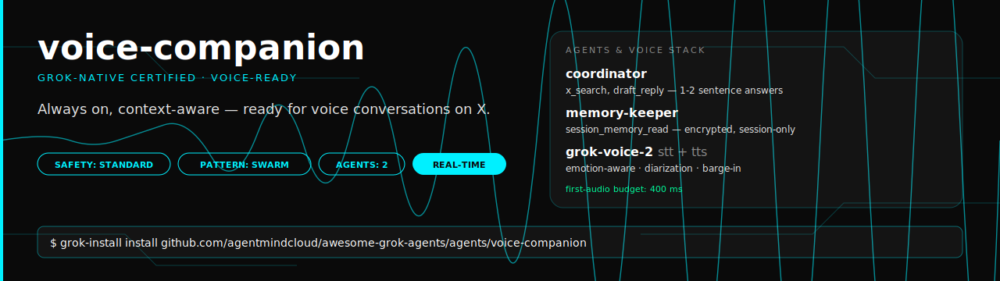
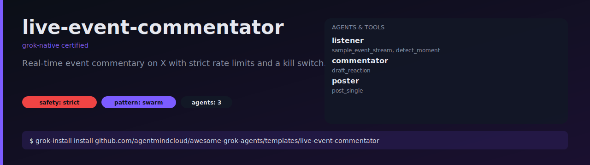

<div align="center">

# awesome-grok-agents

**12 production-ready Grok agents. One command to install.**

A curated gallery of `grok-install`-compatible agent templates built on xAI's Grok
models. Every template is end-to-end runnable, permission-scoped, safety-profiled,
and ships with a working demo.

[](https://github.com/agentmindcloud/awesome-grok-agents/actions/workflows/validate-templates.yml)
[](LICENSE)
[](featured-agents.json)
[](#grok-native-certified)
[](CONTRIBUTING.md)

```bash
pip install grok-install
grok-install install github.com/agentmindcloud/awesome-grok-agents/templates/<name>
```

</div>

## Killer agents _(v2.0 spec)_

Two flagship agents authored on the new `grok-install/v2.0` YAML spec. Each is a complete `.grok/` project with explicit `grok-swarm.yaml`, `grok-voice.yaml`, `safety.yaml`, and full demo pack. Certified `grok-native`, `safety-max`, `voice-ready`, `swarm-ready`.

<table>
<tr>
<td width="50%" valign="top">

### [Viral Thread Architect](agents/viral-thread-architect)

Turn any idea into a fire X thread in seconds — with images, voice version, and perfect formatting.

- 3-agent swarm: coordinator + Lucas (creative) + Benjamin (logic)
- Image generation, voice narration, 8–12 posts
- `safety_profile: strict`, human approval on every post

[Install on X](https://x.com/intent/post?text=%40grok%20install%20github.com%2Fagentmindcloud%2Fawesome-grok-agents%2Fagents%2Fviral-thread-architect) · [Example thread](agents/viral-thread-architect/demo/EXAMPLE_THREAD.md) · [Safety 100/100](agents/viral-thread-architect/SAFETY-REPORT.md)

</td>
<td width="50%" valign="top">

### [Voice Companion](agents/voice-companion)

Your personal Grok voice agent — always on, context-aware, ready for voice conversations on X.

- 2-agent swarm: coordinator + memory-keeper
- Real-time STT + TTS via `grok-voice-2`, emotion-aware, speaker diarization, barge-in
- `safety_profile: standard`, graceful handoff to text, kill switch

[Install on X](https://x.com/intent/post?text=%40grok%20install%20github.com%2Fagentmindcloud%2Fawesome-grok-agents%2Fagents%2Fvoice-companion) · [Example transcript](agents/voice-companion/demo/EXAMPLE_TRANSCRIPT.md) · [Safety 100/100](agents/voice-companion/SAFETY-REPORT.md)

</td>
</tr>
</table>

## What's included

**12 Grok-Native Certified agents**

| # | Name | Pattern | Safety |
|---|------|---------|--------|
| 1 | `viral-thread-architect` _(v2.0)_ | swarm + voice + image | strict |
| 2 | `voice-companion` _(v2.0)_ | swarm + real-time voice | standard |
| 3 | `hello-grok` | single-agent | standard |
| 4 | `reply-engagement-bot` | multi-step | strict |
| 5 | `trend-to-thread` | multi-step | strict |
| 6 | `research-swarm` | swarm | standard |
| 7 | `code-reviewer` | multi-step | strict |
| 8 | `thread-ghostwriter` | multi-step | strict |
| 9 | `personal-knowledge` | multi-step | standard |
| 10 | `scientific-discovery` | swarm | standard |
| 11 | `voice-agent-x` | multi-step | strict |
| 12 | `live-event-commentator` | multi-step | strict |

**Infrastructure**

- CI workflow with structural validation, security scan, mock tool execution, and YAML lint
- In-repo validators (no external CLI dependency)
- `grok_install_stub` — stub runtime for CI
- SVG poster cards for every template
- Contributor tooling: PR template, issue templates, docs

---

## Contents

- [Why this exists](#why-this-exists)
- [Gallery](#gallery)
- [Quick start](#quick-start)
- [Safety model](#safety-model)
- [Grok-Native Certified](#grok-native-certified)
- [Contributing](#contributing)
- [Community](#community)
- [License](#license)

## Why this exists

Every Grok tutorial stops at "hello world." Shipping a real agent means wiring
scheduled jobs, approval gates, kill switches, permission scopes, prompt
versioning, and rate limits — all of which the `grok-install` spec defines but
few examples demonstrate end-to-end. This gallery is that missing layer:
ten templates that cover the patterns you'll actually need (single-agent,
multi-step, swarm) with real tool code, real safety rails, and CI that rejects
anything below the bar.

## Gallery

<table>
<tr><td>
<a href="templates/hello-grok"></a>
</td></tr>
<tr><td>
<a href="templates/reply-engagement-bot"></a>
</td></tr>
<tr><td>
<a href="templates/trend-to-thread"></a>
</td></tr>
<tr><td>
<a href="templates/research-swarm"></a>
</td></tr>
<tr><td>
<a href="templates/code-reviewer"></a>
</td></tr>
<tr><td>
<a href="templates/thread-ghostwriter"></a>
</td></tr>
<tr><td>
<a href="templates/personal-knowledge"></a>
</td></tr>
<tr><td>
<a href="templates/scientific-discovery"></a>
</td></tr>
<tr><td>
<a href="templates/voice-agent-x"></a>
</td></tr>
<tr><td>
<a href="agents/viral-thread-architect"></a>
</td></tr>
<tr><td>
<a href="agents/voice-companion"></a>
</td></tr>
<tr><td>
<a href="templates/live-event-commentator"></a>
</td></tr>
</table>

<details>
<summary>Compact table view</summary>

| # | Name | Pattern | Safety | What it does |
|---|------|---------|--------|--------------|
| 1 | [hello-grok](templates/hello-grok) | single-agent | standard | The simplest possible Grok agent. |
| 2 | [reply-engagement-bot](templates/reply-engagement-bot) | multi-step | strict | Drafts replies to X mentions behind an approval gate. |
| 3 | [trend-to-thread](templates/trend-to-thread) | multi-step | strict | Monitors X trends, drafts a full thread. |
| 4 | [research-swarm](templates/research-swarm) | swarm | standard | Researcher + critic + publisher. |
| 5 | [code-reviewer](templates/code-reviewer) | multi-step | strict | Reviews GitHub PRs with inline comments. |
| 6 | [thread-ghostwriter](templates/thread-ghostwriter) | multi-step | strict | Turns a rough idea into a polished X thread. |
| 7 | [personal-knowledge](templates/personal-knowledge) | multi-step | standard | Persistent, searchable memory of your X history. |
| 8 | [scientific-discovery](templates/scientific-discovery) | swarm | standard | Daily arXiv + X discussion brief. |
| 9 | [voice-agent-x](templates/voice-agent-x) | multi-step | strict | Speak a post, review, approve, publish. |
| 10 | [live-event-commentator](templates/live-event-commentator) | multi-step | strict | Real-time event commentary on X. |
| 11 | [viral-thread-architect](agents/viral-thread-architect) | swarm + voice + image | strict | 3-agent swarm: any idea → polished X thread with images + voice (v2.0 spec). |
| 12 | [voice-companion](agents/voice-companion) | swarm + real-time voice | standard | 2-agent voice-first swarm with session memory, emotion-aware TTS, graceful text handoff (v2.0 spec). |

</details>

## Quick start

```bash
pip install grok-install

# Install any template
grok-install install github.com/agentmindcloud/awesome-grok-agents/templates/hello-grok

# Configure
cd hello-grok
cp .env.example .env      # fill in XAI_API_KEY and any other secrets

# Run
grok-install run          # one-shot
grok-install schedule     # background daemon where applicable
```

## Safety model

Every template declares a `safety_profile`, an explicit permission list, and
(where it touches the world) a kill-switch env var. Writes to X, GitHub, email,
and other external services are gated behind approval tokens — a human signs
off once per destination, not once per action.

| Profile | Meaning | Typical use |
|---------|---------|-------------|
| `strict` | Writes external side effects. Must declare `requires_approval` and a kill switch. | Posting to X, emailing, PR comments. |
| `standard` | Reads only, or writes to local storage. | Summarizers, indexers, research agents. |
| `permissive` | Trusted sandboxed environments. | Not used by any certified template. |

The approval pattern, token shape, and kill-switch convention are documented in
[docs/template-anatomy.md](docs/template-anatomy.md).

## Grok-Native Certified

Templates tagged `certified: true` in
[featured-agents.json](featured-agents.json) meet every item on this bar:

- Runs end-to-end (CI enforced on every PR)
- Declares permissions explicitly
- Sets an appropriate `safety_profile`
- Every tool has a complete JSON schema
- X-writing tools gated behind human approval
- Rate limits declared
- No hardcoded credentials
- Under 150 lines of YAML total

CI runs `validate_template`, `scan_template`, `mock_run_template`, and
`yamllint` against every template on every PR. See
[.github/workflows/validate-templates.yml](.github/workflows/validate-templates.yml).

## Contributing

Want to add your agent to the gallery? Start with
[CONTRIBUTING.md](CONTRIBUTING.md) and
[docs/submitting-your-own.md](docs/submitting-your-own.md). Your PR must pass
the full validation workflow — no exceptions, no legacy carve-outs.

Found a bug in an existing template? Open a
[bug report](.github/ISSUE_TEMPLATE/bug.yml).

## Community

- **Report a security issue:** see [SECURITY.md](SECURITY.md).
- **Code of conduct:** [CODE_OF_CONDUCT.md](CODE_OF_CONDUCT.md).
- **Release history:** [CHANGELOG.md](CHANGELOG.md).

## License

Apache 2.0. See [LICENSE](LICENSE).
