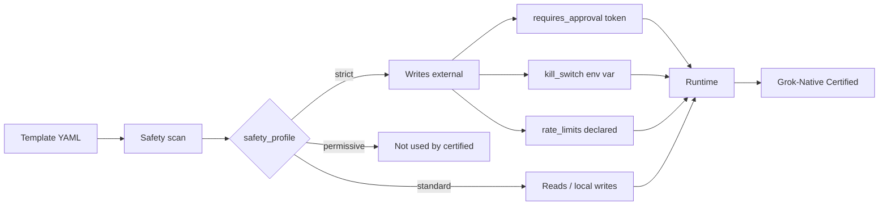

<!-- NEON / CYBERPUNK REPO TEMPLATE · AWESOME-GROK-AGENTS -->

<p align="center">
  
</p>

<h1 align="center">⚡ awesome-grok-agents</h1>

<p align="center">
  <b>A curated gallery of grok-install-compatible agent templates.</b><br/>
  End-to-end runnable · Permission-scoped · Safety-profiled · Working demos.
</p>

<p align="center">
  
</p>

<p align="center">
  <a href="https://github.com/agentmindcloud/awesome-grok-agents/actions/workflows/validate-templates.yml"></a>
  <a href="LICENSE"></a>
  <a href="featured-agents.json"></a>
  <a href="#grok-native-certified"></a>
  <a href="CONTRIBUTING.md"></a>
  <a href="https://github.com/agentmindcloud/awesome-grok-agents"></a>
</p>

---

## ✦ One-Line Install

```bash
pip install git+https://github.com/agentmindcloud/grok-install
grok-install install github.com/agentmindcloud/awesome-grok-agents/templates/<name>
```

> A PyPI release of `grok-install` is in progress; until then, install
> directly from the sibling repo as shown above.

## ✦ Why This Exists

<table>
  <tr>
    <td width="33%">
      <h3>🎯 Past Hello-World</h3>
      <p>Every Grok tutorial stops at "hello world." This gallery is the missing layer — scheduled jobs, approval gates, kill switches, prompt versioning, rate limits.</p>
    </td>
    <td width="33%">
      <h3>🏗️ Real Patterns</h3>
      <p>Ten templates covering what you'll actually ship: single-agent, multi-step, swarm. Real tool code, real safety rails.</p>
    </td>
    <td width="33%">
      <h3>🛡️ CI-Enforced Bar</h3>
      <p>Structural validation, security scan, mock tool execution, YAML lint, JSON Schema check, spec-version gate, link check. Nothing below the bar merges.</p>
    </td>
  </tr>
</table>

## ✦ The Ten Templates

<p align="center">
  
  
  
  
  
</p>
<p align="center">
  
  
  
  
  
</p>

## ✦ Gallery

<table>
  <tr>
    <td width="50%">
      <h3>👋 hello-grok</h3>
      <p><b>Pattern:</b> single-agent · <b>Safety:</b> standard</p>
      <p>The simplest possible Grok agent. Start here.</p>
      <a href="https://github.com/AgentMindCloud/awesome-grok-agents/tree/main/templates/hello-grok">Template →</a>
    </td>
    <td width="50%">
      <h3>💬 reply-engagement-bot</h3>
      <p><b>Pattern:</b> multi-step · <b>Safety:</b> strict</p>
      <p>Drafts replies to X mentions behind an approval gate.</p>
      <a href="https://github.com/AgentMindCloud/awesome-grok-agents/tree/main/templates/reply-engagement-bot">Template →</a>
    </td>
  </tr>
  <tr>
    <td>
      <h3>🧵 trend-to-thread</h3>
      <p><b>Pattern:</b> multi-step · <b>Safety:</b> strict</p>
      <p>Monitors X trends, drafts a full thread from breakout signals.</p>
      <a href="https://github.com/AgentMindCloud/awesome-grok-agents/tree/main/templates/trend-to-thread">Template →</a>
    </td>
    <td>
      <h3>🔬 research-swarm</h3>
      <p><b>Pattern:</b> swarm · <b>Safety:</b> standard</p>
      <p>Researcher + critic + publisher working in parallel.</p>
      <a href="https://github.com/AgentMindCloud/awesome-grok-agents/tree/main/templates/research-swarm">Template →</a>
    </td>
  </tr>
  <tr>
    <td>
      <h3>🧑‍💻 code-reviewer</h3>
      <p><b>Pattern:</b> multi-step · <b>Safety:</b> strict</p>
      <p>Reviews GitHub PRs with inline comments and diff awareness.</p>
      <a href="https://github.com/AgentMindCloud/awesome-grok-agents/tree/main/templates/code-reviewer">Template →</a>
    </td>
    <td>
      <h3>✍️ thread-ghostwriter</h3>
      <p><b>Pattern:</b> multi-step · <b>Safety:</b> strict</p>
      <p>Turns a rough idea into a polished X thread you can post or edit.</p>
      <a href="https://github.com/AgentMindCloud/awesome-grok-agents/tree/main/templates/thread-ghostwriter">Template →</a>
    </td>
  </tr>
  <tr>
    <td>
      <h3>🧠 personal-knowledge</h3>
      <p><b>Pattern:</b> multi-step · <b>Safety:</b> standard</p>
      <p>Persistent, searchable memory of your X history.</p>
      <a href="https://github.com/AgentMindCloud/awesome-grok-agents/tree/main/templates/personal-knowledge">Template →</a>
    </td>
    <td>
      <h3>🔭 scientific-discovery</h3>
      <p><b>Pattern:</b> swarm · <b>Safety:</b> standard</p>
      <p>Daily arXiv and X discussion brief on topics you follow.</p>
      <a href="https://github.com/AgentMindCloud/awesome-grok-agents/tree/main/templates/scientific-discovery">Template →</a>
    </td>
  </tr>
  <tr>
    <td>
      <h3>🎤 voice-agent-x</h3>
      <p><b>Pattern:</b> multi-step · <b>Safety:</b> strict</p>
      <p>Speak a post, review the transcript, approve, publish.</p>
      <a href="https://github.com/AgentMindCloud/awesome-grok-agents/tree/main/templates/voice-agent-x">Template →</a>
    </td>
    <td>
      <h3>📡 live-event-commentator</h3>
      <p><b>Pattern:</b> multi-step · <b>Safety:</b> strict</p>
      <p>Real-time event commentary on X with rate-limited posting.</p>
      <a href="https://github.com/AgentMindCloud/awesome-grok-agents/tree/main/templates/live-event-commentator">Template →</a>
    </td>
  </tr>
</table>

<details>
<summary><b>Compact table view</b></summary>

| # | Name | Pattern | Safety | What it does |
|---|------|---------|--------|--------------|
| 1 | [hello-grok](https://github.com/AgentMindCloud/awesome-grok-agents/tree/main/templates/hello-grok) | single-agent | standard | The simplest possible Grok agent. |
| 2 | [reply-engagement-bot](https://github.com/AgentMindCloud/awesome-grok-agents/tree/main/templates/reply-engagement-bot) | multi-step | strict | Drafts replies to X mentions behind an approval gate. |
| 3 | [trend-to-thread](https://github.com/AgentMindCloud/awesome-grok-agents/tree/main/templates/trend-to-thread) | multi-step | strict | Monitors X trends, drafts a full thread. |
| 4 | [research-swarm](https://github.com/AgentMindCloud/awesome-grok-agents/tree/main/templates/research-swarm) | swarm | standard | Researcher + critic + publisher. |
| 5 | [code-reviewer](https://github.com/AgentMindCloud/awesome-grok-agents/tree/main/templates/code-reviewer) | multi-step | strict | Reviews GitHub PRs with inline comments. |
| 6 | [thread-ghostwriter](https://github.com/AgentMindCloud/awesome-grok-agents/tree/main/templates/thread-ghostwriter) | multi-step | strict | Turns a rough idea into a polished X thread. |
| 7 | [personal-knowledge](https://github.com/AgentMindCloud/awesome-grok-agents/tree/main/templates/personal-knowledge) | multi-step | standard | Persistent, searchable memory of your X history. |
| 8 | [scientific-discovery](https://github.com/AgentMindCloud/awesome-grok-agents/tree/main/templates/scientific-discovery) | swarm | standard | Daily arXiv + X discussion brief. |
| 9 | [voice-agent-x](https://github.com/AgentMindCloud/awesome-grok-agents/tree/main/templates/voice-agent-x) | multi-step | strict | Speak a post, review, approve, publish. |
| 10 | [live-event-commentator](https://github.com/AgentMindCloud/awesome-grok-agents/tree/main/templates/live-event-commentator) | multi-step | strict | Real-time event commentary on X. |

</details>

## ✦ Quick Start

```bash
pip install git+https://github.com/agentmindcloud/grok-install

# Install any template
grok-install install github.com/agentmindcloud/awesome-grok-agents/templates/hello-grok

# Configure
cd hello-grok
cp .env.example .env      # fill in XAI_API_KEY and any other secrets

# Run
grok-install run          # one-shot
grok-install schedule     # background daemon where applicable
```

## ✦ Safety Architecture



Every template declares a `safety_profile`, an explicit permission list, and — where it touches the world — a kill-switch env var. Writes to X, GitHub, email, and external services are gated behind approval tokens. A human signs off once per destination, not once per action.

| Profile | Meaning | Typical use |
|---------|---------|-------------|
| `strict` | Writes external side effects. Must declare `requires_approval` and a kill switch. | Posting to X, emailing, PR comments. |
| `standard` | Reads only, or writes to local storage. | Summarizers, indexers, research agents. |
| `permissive` | Trusted sandboxed environments. | Not used by any certified template. |

Full conventions: [`docs/template-anatomy.md`](docs/template-anatomy.md).

## ✦ Grok-Native Certified

Templates tagged `certified: true` in [`featured-agents.json`](featured-agents.json) meet every item on this bar:

<table>
  <tr>
    <td width="50%">
      <h3>✅ Runs End-to-End</h3>
      <p>CI enforced on every PR. No "works on my machine."</p>
    </td>
    <td width="50%">
      <h3>🔒 Permissions Explicit</h3>
      <p>Every capability declared. No implicit access.</p>
    </td>
  </tr>
  <tr>
    <td>
      <h3>🛡️ Safety Profile Set</h3>
      <p><code>strict</code>, <code>standard</code>, or <code>permissive</code> — appropriate to the agent.</p>
    </td>
    <td>
      <h3>📐 Full Tool Schemas</h3>
      <p>Every tool declares a complete JSON Schema for parameters + returns.</p>
    </td>
  </tr>
  <tr>
    <td>
      <h3>✋ Human Approval Gates</h3>
      <p>X-writing tools and external side effects gated behind human approval tokens.</p>
    </td>
    <td>
      <h3>⏱️ Rate Limits Declared</h3>
      <p>Per-tool QPS + daily caps. No runaway posting.</p>
    </td>
  </tr>
  <tr>
    <td>
      <h3>🔑 No Hardcoded Credentials</h3>
      <p>All secrets via env vars. CI scans block anything else.</p>
    </td>
    <td>
      <h3>📏 Under 150 Lines</h3>
      <p>Keeps every template scannable in under a minute.</p>
    </td>
  </tr>
</table>

### CI workflow

Every PR runs: `yamllint` → `validate_registry` → `ajv-cli` JSON Schema check → `spec-version` gate (templates must declare `grok-install/v2.12`, `v2.13`, or `v2.14`) → `lychee` link check on template READMEs → per-template `validate_template`, `scan_template`, and `mock_run_template`. See [`.github/workflows/validate-templates.yml`](.github/workflows/validate-templates.yml).

Tagged `v*` pushes also trigger [`.github/workflows/release.yml`](.github/workflows/release.yml), which publishes a GitHub Release with notes from [`CHANGELOG.md`](CHANGELOG.md).

## ✦ Infrastructure

<table>
  <tr>
    <td width="50%">
      <h3>🧪 In-Repo Validators</h3>
      <p>No external CLI dependency. Everything runs inside the repo via <code>scripts/</code>.</p>
    </td>
    <td width="50%">
      <h3>🤖 grok_install_stub</h3>
      <p>Stub runtime for CI — mock tool execution without real xAI calls.</p>
    </td>
  </tr>
  <tr>
    <td>
      <h3>🎨 Poster Generator</h3>
      <p><code>scripts/gen_poster.py</code> produces SVG poster cards for every template.</p>
    </td>
    <td>
      <h3>📋 Registry Schema</h3>
      <p><a href="schemas/featured-agents.schema.json">JSON Schema</a> validates the full registry.</p>
    </td>
  </tr>
  <tr>
    <td>
      <h3>🚀 Tag-Triggered Releases</h3>
      <p>Push a <code>v*</code> tag → GitHub Release published from <code>CHANGELOG.md</code>.</p>
    </td>
    <td>
      <h3>✨ v2.14 Visuals Block</h3>
      <p>Optional <code>visuals:</code> on 5 hero templates — dark-premium install surface.</p>
    </td>
  </tr>
</table>

## ✦ Sibling Repos

<table>
  <tr>
    <td width="33%">
      <h3>📦 grok-install</h3>
      <p>The spec this gallery demonstrates end-to-end.</p>
      <a href="https://github.com/agentmindcloud/grok-install">Repository →</a>
    </td>
    <td width="33%">
      <h3>📐 grok-yaml-standards</h3>
      <p>12 modular YAML extensions beyond the core spec.</p>
      <a href="https://github.com/agentmindcloud/grok-yaml-standards">Repository →</a>
    </td>
    <td width="33%">
      <h3>🎭 grok-agent-orchestra</h3>
      <p>Multi-agent runtime with mandatory safety veto.</p>
      <a href="https://github.com/agentmindcloud/grok-agent-orchestra">Repository →</a>
    </td>
  </tr>
</table>

## ✦ Contributing

Want to add your agent to the gallery? Start with [CONTRIBUTING.md](CONTRIBUTING.md) and [`docs/submitting-your-own.md`](docs/submitting-your-own.md).

**Your PR must pass the full validation workflow — no exceptions, no legacy carve-outs.**

Found a bug in an existing template? Open a [bug report](.github/ISSUE_TEMPLATE/bug.yml).

## ✦ Community

- 🔐 **Report a security issue:** see [SECURITY.md](SECURITY.md)
- 📜 **Release history:** [CHANGELOG.md](CHANGELOG.md)

## ✦ Connect

<p align="center">
  <a href="https://github.com/agentmindcloud">
    
  </a>
  <a href="https://x.com/JanSol0s">
    
  </a>
  <a href="https://www.jansolos.com">
    
  </a>
</p>

## ✦ License

Apache 2.0. See [LICENSE](LICENSE).

<p align="center">
  
</p>
