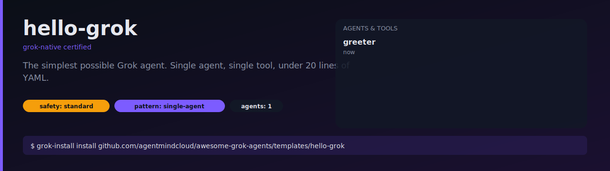

# hello-grok

The simplest possible Grok agent. One agent, one tool, under 20 lines of
YAML. Use this as the starting point for your own template.



## What it does

Greets you and tells you the current UTC time via a single `now` tool.

## Install

```bash
grok-install install github.com/agentmindcloud/awesome-grok-agents/templates/hello-grok
```

## Configure

```bash
cp .env.example .env
# add XAI_API_KEY
```

## Run

```bash
grok-install run
```

## Anatomy

- `grok-install.yaml` — root config, points at `.grok/grok-agent.yaml`
- `.grok/grok-agent.yaml` — one agent named `greeter`
- `.grok/grok-prompts.yaml` — system prompt referenced by key
- `.grok/grok-security.yaml` — `standard` profile, one permission
- `tools/custom_tools.py` — the `now` tool

Read [docs/template-anatomy.md](../../docs/template-anatomy.md) for the full
layout spec.
