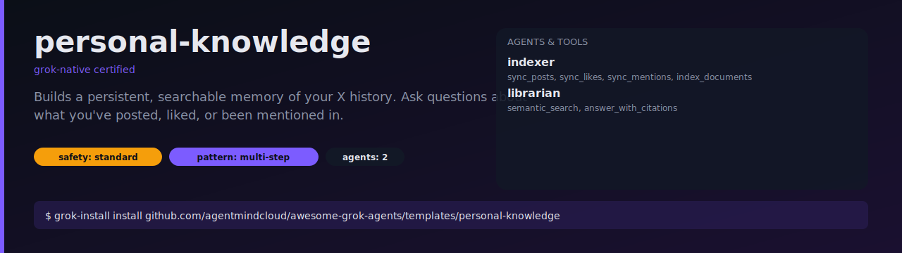

# personal-knowledge

A persistent, searchable memory of your X history. Ask questions about
what you've posted, liked, or been mentioned in — and get answers backed
by links to the original posts.



## What it does

- Every 6 hours, the `indexer` pulls new posts, likes, and mentions and
  upserts them into a local vector index.
- On `ask` mode, the `librarian` runs a semantic search against the index
  and produces an answer with inline permalink citations.
- If fewer than 3 relevant hits, it refuses to answer rather than
  hallucinate.

## Install

```bash
grok-install install github.com/agentmindcloud/awesome-grok-agents/templates/personal-knowledge
```

## Configure

```bash
cp .env.example .env
```

## Run

```bash
# Build / refresh the index
grok-install run --mode refresh

# Ask a question
grok-install run --mode ask --input question="What did I say about Grok-4 last quarter?"

# Run the scheduled refresh in the background
grok-install schedule
```

## Safety

- `safety_profile: standard` — this template only reads.
- All state stored locally in the vector index.
- No write permissions.
- Rate limited to 300 X API calls/hour.
