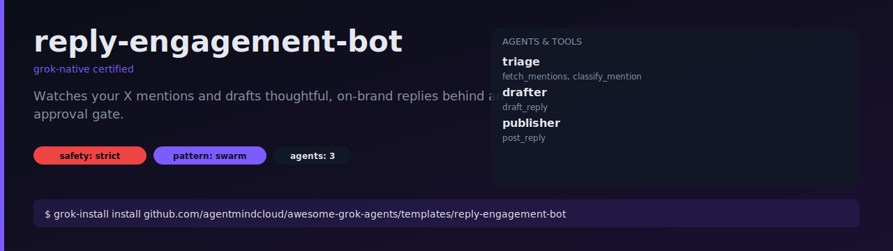

# reply-engagement-bot

Watches your X mentions, classifies which are worth replying to, drafts a
reply in your voice, and queues each one for human approval before posting.



## What it does

1. Every 5 minutes, fetches new mentions since the last check.
2. A `triage` agent classifies each mention — real humans get through, spam
   and low-effort takes are dropped.
3. A `drafter` agent writes a short, on-brand reply for each one worth
   answering.
4. Drafts land in your approval queue. You tap approve or edit.
5. A `publisher` agent posts only approved drafts, rejecting anything
   without an `appr_` token.

## Install

```bash
grok-install install github.com/agentmindcloud/awesome-grok-agents/templates/reply-engagement-bot
```

## Configure

```bash
cp .env.example .env
```

Fill in `XAI_API_KEY` and the X app credentials (`X_BEARER_TOKEN`,
`X_API_KEY`, `X_API_SECRET`, `X_ACCESS_TOKEN`, `X_ACCESS_SECRET`).

Set `REPLY_BOT_DISABLED=1` to flip the kill switch without uninstalling.

## Run

```bash
grok-install run          # one-shot
grok-install schedule     # run on the 5m cadence declared in grok-install.yaml
```

## Safety

- `safety_profile: strict`
- `post_reply` is gated under `requires_approval`
- Rate limited to 15 posts/hour
- Kill switch via `REPLY_BOT_DISABLED=1`
- No write permissions beyond `api.x.com`
