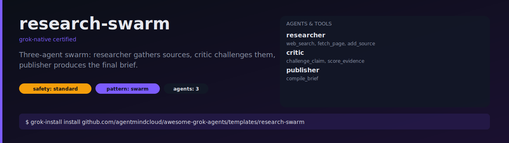

# research-swarm

A three-agent swarm that answers hard questions. The researcher gathers
sources, the critic challenges them, and the publisher produces the final
brief — with nothing the critic rejected.



## What it does

1. **Researcher** searches the web, fetches pages, and registers 5-8
   high-quality sources for the question.
2. **Critic** tries to falsify each claim, scores evidence strength, and
   flags claims that rest on a single or non-primary source.
3. **Researcher** does a second pass filling the gaps the critic flagged.
4. **Publisher** compiles a brief with a TL;DR, 3-5 findings, open
   questions, and inline citations.

This is the canonical "multi-agent reasoning" template — use it as a
starting point for any problem where one agent isn't enough.

## Install

```bash
grok-install install github.com/agentmindcloud/awesome-grok-agents/templates/research-swarm
```

## Configure

```bash
cp .env.example .env
# Set XAI_API_KEY and TAVILY_API_KEY (or swap in another search backend)
```

## Run

```bash
grok-install run --input question="What happened to Moore's law after 2020?"
```

## Safety

- `safety_profile: standard`
- Broad web access is required — open-web browsing is expected.
- Max 60 fetches per run prevents runaway crawls.
- No external write permissions.
