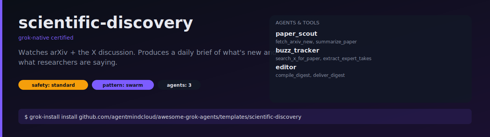

# scientific-discovery

Daily brief of the newest arXiv papers in your areas of interest, paired
with what real researchers are saying about them on X.



## What it does

1. Every day at 14:00 UTC, `paper_scout` pulls new arXiv papers in the
   configured categories (default: `cs.AI`, `cs.LG`, `cs.CL`).
2. For each paper, `buzz_tracker` searches X and extracts 2-4 credible
   expert takes (authors, senior researchers).
3. `editor` composes a digest with a one-sentence overview, per-paper
   summaries, and the expert reactions, then delivers it by email.

## Install

```bash
grok-install install github.com/agentmindcloud/awesome-grok-agents/templates/scientific-discovery
```

## Configure

```bash
cp .env.example .env
# Set DIGEST_TO and your SMTP credentials
```

Edit `arxiv_categories` and `max_papers` in `.grok/grok-workflow.yaml` to
match your interests.

## Run

```bash
grok-install run           # one-shot
grok-install schedule      # run daily at the configured cron
```

## Safety

- `safety_profile: strict` — email is a real external side effect.
- `deliver_digest` is gated under `requires_approval`. Approve once with
  "remember destination" so daily runs don't nag.
- Max 1 digest per day.
- Kill switch: `DIGEST_DISABLED=1`.
