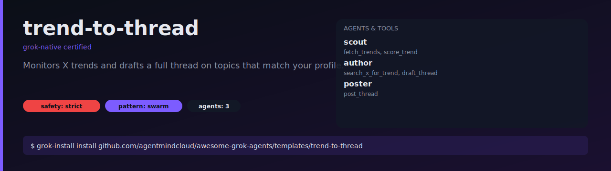

# trend-to-thread

Watches X trends inside a topic allowlist, scores each one, and drafts a
6-tweet thread on the winner for your approval.



## What it does

1. Every 30 minutes, the `scout` agent pulls current trends and keeps only
   the ones matching your topic allowlist (default: `ai`, `developer-tools`,
   `open-source`).
2. Each candidate gets a 0-1 score on relevance, novelty, and conversation
   depth.
3. If the top score clears `min_score` (default `0.65`), the `author` agent
   pulls real sample posts and drafts a 6-tweet thread with a hook, an
   observation, an example, and a CTA.
4. The draft lands in your approval queue.
5. The `poster` agent publishes only approved drafts.

## Install

```bash
grok-install install github.com/agentmindcloud/awesome-grok-agents/templates/trend-to-thread
```

## Configure

```bash
cp .env.example .env
```

Edit the `topics` list in `.grok/grok-workflow.yaml` if you want different
categories. Lower `min_score` to post more aggressively; raise it to be
picky.

## Run

```bash
grok-install run
grok-install schedule   # 30m cadence
```

## Safety

- `safety_profile: strict`
- Max 4 threads per day
- `post_thread` gated behind approval
- Kill switch: `TREND_BOT_DISABLED=1`
